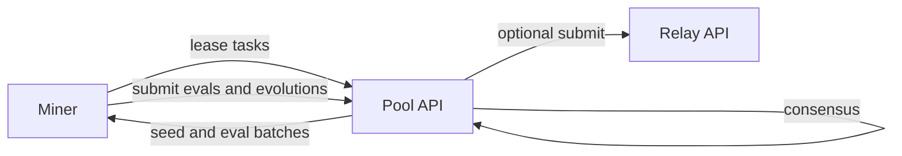

# Pool Mining Guide

Pool mining lets many miners cooperate on evolution and evaluation tasks, then share rewards based on contribution. Instead of a single miner running long local searches, the Pool coordinates smaller chunks of work and aggregates results.

## What is Pool Mining?

Pool mining is a collaborative approach where the pool coordinator distributes tasks to multiple miners. Some miners evolve algorithms while others evaluate them. The pool aggregates results, achieves consensus, and submits the best algorithms to validators on behalf of all participants.

## How It Works



1. Miner registers and authenticates using Bittensor hotkey signatures.
2. Miner requests work as a batch or a lease.
3. Pool returns:
   - algorithms to evaluate
   - seed algorithms to evolve
   - an evolve budget and timeouts
4. Miner submits evaluations and evolution proposals back to the Pool.
5. Pool computes consensus once enough evaluations exist.
6. Pool records contributions and runs epoch logic to compute payouts.
7. Pool can optionally forward top results to the relay for validator coordination.

## Pool vs Direct Mining

**Pool Mining:**
- Lower compute requirements (shorter evolution runs)
- Consistent small rewards for evaluation work
- No need to beat SOTA yourself
- Pool handles validator communication
- Share rewards with other pool participants

**Direct Mining:**
- Higher compute requirements (full evolution cycles)
- Larger but less frequent rewards
- Must beat SOTA threshold
- Direct communication with validators
- Keep 100% of rewards

Choose pool mining if you have:
- Limited hardware (laptop, single CPU)
- Inconsistent availability (can't run 24/7)
- Preference for steady income over lottery-style rewards

## Requirements

**Hardware:**
- CPU: 2+ cores
- RAM: 4GB minimum
- Storage: 1GB free space
- Network: Stable internet connection

**Software:**
- Python 3.10 or higher
- Bittensor wallet

## Setup

Pool mode is typically driven by the GUI, but the same workflow can be exercised locally with scripts.

### GUI mode

Examples below assume all repos live under the same parent directory:

```bash
export BITSOTA_DEV_ROOT=~/bitsota-dev
```

Known-good local checklist:

- `SN94-BitSota` on branch `testnet-net-gui-pool-agents`
- separate `Pool` checkout on branch `testing`
- `automl_zero_cpp` checkout available locally
- Pool API reachable at `http://127.0.0.1:8434`
- `Pool` is a separate checkout beside `SN94-BitSota`, not a folder inside this repo

Create `gui_config.json` in the `SN94-BitSota` repo root and set:

```json
{
  "pool_endpoint": "http://127.0.0.1:8434"
}
```

Start the local Pool API first if you are not using a compose stack:

```bash
cd "${BITSOTA_DEV_ROOT}/Pool"
git switch testing

export PYENV_VERSION=automl_pool
export POSTGRES_USER=pooler
export POSTGRES_PASSWORD=test
export POSTGRES_DB=mining_pool
export POSTGRES_HOST=127.0.0.1
export POSTGRES_PORT=5432
export ENVIRONMENT=development
export LEASE_MIN_ITERATIONS=0

python -m uvicorn app.main:app --host 127.0.0.1 --port 8434
```

Then start the GUI with the C++ backend enabled:

```bash
export PYENV_VERSION=automl_pool
export BITSOTA_MINER_BACKEND=cpp
export AUTOML_ZERO_CPP_ROOT="${BITSOTA_DEV_ROOT}/automl_zero_cpp/automl_zero"
python3 -m gui
```

Use the current GUI flow:
- Open the `Pool Mining` tab.
- Click `Join Pool` on `Lease Pool` for the recommended path.
- Click `Start Mining` on the pool detail screen.

What good looks like:

- GUI log: `[pool] Registered with pool`
- GUI log: `[pool] Enqueued job kind=lease lease_id=...`
- GUI log: `[pool] submit_lease ok=True ...`
- Pool API terminal: `register`, `lease`, and `submit_lease` all return `200`
- Sidecar state: `successful_submissions > 0`

Simple pass/fail check after you click `Start Mining`:

```bash
cd "${BITSOTA_DEV_ROOT}/SN94-BitSota"
PYENV_VERSION=automl_pool python3 -m scripts.check_local_pool_stack \
  --pool-url http://127.0.0.1:8434 \
  --sidecar-url http://127.0.0.1:8123 \
  --require-progress
```

`Task Pool` is still shown for the legacy task-batch path, but `Lease Pool` is the main sidecar + C++ worker flow to test.

### Headless mode with sidecar

Use this if you want the same backend path as the GUI, but without opening the GUI.

Open four terminals. Commands assume `export BITSOTA_DEV_ROOT=~/bitsota-dev`.

This matches the GUI architecture:

- one sidecar process
- one C++ compute worker (`scripts.miner_cpp_sidecar --cpp-mode lease`) that pulls jobs from sidecar
- one driver that talks to the Pool API and submits results

Terminal 0 (Pool API):

```bash
cd "${BITSOTA_DEV_ROOT}/Pool"
git switch testing

export PYENV_VERSION=automl_pool
export POSTGRES_USER=pooler
export POSTGRES_PASSWORD=test
export POSTGRES_DB=mining_pool
export POSTGRES_HOST=127.0.0.1
export POSTGRES_PORT=5432
export ENVIRONMENT=development
export LEASE_MIN_ITERATIONS=0

python3 -m uvicorn app.main:app --host 127.0.0.1 --port 8434
```

Terminal 1 (sidecar):

```bash
cd "${BITSOTA_DEV_ROOT}/SN94-BitSota"
PYENV_VERSION=automl_pool python3 -m sidecar --host 127.0.0.1 --port 8123
```

Terminal 2 (C++ worker):

```bash
cd "${BITSOTA_DEV_ROOT}/SN94-BitSota"
export BITSOTA_MINER_BACKEND=cpp
export AUTOML_ZERO_CPP_ROOT="${BITSOTA_DEV_ROOT}/automl_zero_cpp/automl_zero"
PYENV_VERSION=automl_pool python3 -m scripts.miner_cpp_sidecar \
  --cpp-mode lease \
  --mode real \
  --sidecar-url http://127.0.0.1:8123 \
  --run-id pool_smoke \
  --workers 1 \
  --automl-root "${AUTOML_ZERO_CPP_ROOT}" \
  --bitsota-root "$(pwd)"
```

Terminal 3 (lease driver):

```bash
cd "${BITSOTA_DEV_ROOT}/SN94-BitSota"
PYENV_VERSION=automl_pool python3 -m scripts.pool_lease_sidecar_driver \
  --pool-url http://127.0.0.1:8434 \
  --sidecar-url http://127.0.0.1:8123 \
  --run-id pool_smoke \
  --duration-s 30
```

Smoke-check:

```bash
cd "${BITSOTA_DEV_ROOT}/SN94-BitSota"
PYENV_VERSION=automl_pool python3 -m scripts.check_local_pool_stack \
  --pool-url http://127.0.0.1:8434 \
  --sidecar-url http://127.0.0.1:8123 \
  --require-progress
```

## Understanding Pool Tasks

**Evolution Tasks:**
In lease mode, you receive a local population context (evaluated + seed + gossip IDs), run local evolution, then submit your best candidate (bounded by lease `evolve_budget`).

Rewards:
- Evolver points are based on verified improvement against a baseline (`sota`, `genealogy`, or `local_evolver` mode).
- Points are weighted by consensus config (`evolver_weight`) and can include repetition penalties.

**Evaluation Tasks:**
You receive a batch of algorithms evolved by other miners. You run each algorithm on the test dataset and report scores.

Rewards:
- Evaluator points are agreement-driven (`agreements - disagreements`) with `evaluator_weight`.
- Agreement means your score is within tolerance of the strict consensus cluster.

## Consensus Mechanism

The pool uses strict `k-of-n` consensus to prevent cheating:

1. Algorithm A needs evaluation
2. Pool receives scores from multiple miners
3. Server finds the tightest tolerance cluster with enough support (`consensus_threshold`)
4. If the cluster size is below threshold, no consensus score is set
5. Miners inside the cluster count as agreement; outside count as disagreement
6. Positive payout is gated by:
   - `in_consensus == true`
   - minimum current-window activity (`min_reward_activity`)

This prevents both:
- Inflating scores (claiming 0.99 when algorithm scores 0.80)
- Deflating scores (claiming 0.60 to sabotage others)

## Reputation and Rewards

The pool tracks reputation points throughout each epoch (typically 1 hour):

**Reputation accumulation:**
```
Epoch 1:
- evaluator points from agreements/disagreements = 10.0 reputation
- evolver points from verified improvements (after penalties) = 3.1 reputation
- Total: 13.1 reputation points
```

**Conversion to RAO:**
At epoch end, total epoch budget (e.g., 1,000,000,000 RAO) is distributed proportionally:

```
Your RAO = (Your Reputation / Total Pool Reputation) × Epoch Budget
```

If total pool reputation is 1000 and you earned 13.1:
```
Your RAO = (13.1 / 1000) × 1,000,000,000 = 13,100,000 RAO
```

**Withdrawal:**
Once you accumulate at least 5,000,000 RAO, you can withdraw to your coldkey. Withdrawals are processed manually by the pool operator.

## Pool Economics

**Pool fees:**
Check with pool operator. Typical structure is 5-10% of rewards go to pool for infrastructure and validator costs.

**Minimum payout:**
5,000,000 RAO minimum to reduce transaction overhead.

**Epoch duration:**
Most pools use 1-hour epochs. Shorter epochs = more frequent small payouts. Longer epochs = less frequent larger payouts.

**Per-miner cap:**
Pools may cap individual rewards at 5% of epoch budget to ensure fair distribution.

## Monitoring Your Performance

**Balance check:**
Pool GUI shows current balance and pending rewards.

**Evaluation accuracy rate:**
Track what percentage of your evaluations fall within consensus. Target 95%+ accuracy.

**Evolution success rate:**
Track how many of your evolved algorithms achieve positive verified improvement and remain in consensus.

**Reputation per hour:**
Monitor your earning rate. Optimize by:
- Running evaluation tasks when available (faster reputation)
- Improving evolution parameters for higher consensus scores
- Maintaining high evaluation accuracy

## Troubleshooting

**"No tasks available":**
Pool may be temporarily out of tasks. Wait 30-60 seconds and retry. If persistent, check Discord for pool status.

**"Task timeout":**
You took longer than 3 hours to complete a task. Task was reassigned to another miner. Ensure your hardware can complete tasks faster or reduce `max_generations`.

**"Evaluation rejected - not in consensus":**
Your scores significantly differed from other evaluators. Possible causes:
- Bug in your evaluation code
- Different dataset version (ensure you're updated)
- Hardware issue causing incorrect calculations

Update your software and verify installation.

**"Cannot withdraw - below minimum":**
Accumulate at least 5,000,000 RAO before withdrawing.

## Pool API and auth

Pool endpoints use auth headers:

- `X-Key` hotkey
- `X-Timestamp` unix seconds
- `X-Signature` signature over `auth:{X-Timestamp}`

See [Pool API](reference/pool-api.md) for the endpoint list.

## Tips for Pool Miners

**Optimize task selection:**
If given a choice, evaluation tasks are faster reputation but evolution tasks can yield higher rewards per task if your algorithms score well.

**Run continuously:**
Pool mining benefits from consistency. Running 24/7 accumulates steady reputation.

**Monitor pool health:**
Check pool's total participants. Overpopulated pools = smaller individual shares. Consider switching pools or direct mining if ROI drops.

**Maintain accuracy:**
One bad evaluation that falls outside consensus doesn't hurt much, but consistent inaccuracy will reduce your rewards significantly.

**Update regularly:**
Pool operators update task types and parameters. Keep your miner software updated to stay compatible.

## Next steps

- If you are running locally, start at [Pool Functional Testing](guides/pool-functional-testing.md).
- If you are running an end-to-end loop with relay and validator, start at [Local Testing](local-testing.md).

## Next Steps

- Join [Bitsota Discord](https://discord.gg/jkJWJtPuw7) for pool mining support
- Monitor your reputation and optimize your mining strategy
- Consider switching to direct mining if you upgrade hardware

For understanding how rewards work across the entire system, see [Rewards Guide](rewards.md).
