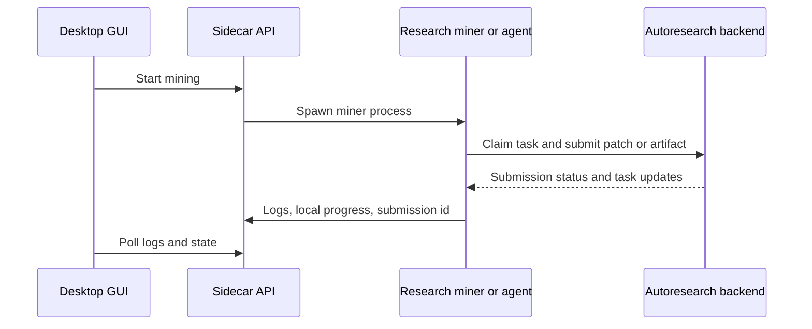
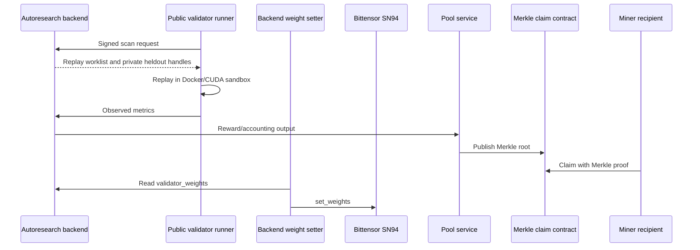
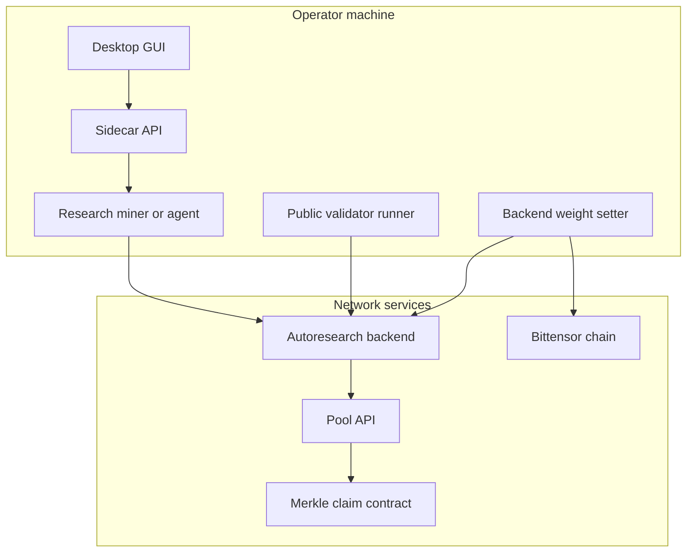

# Architecture

This page maps the current autoresearch production path. For operator
responsibilities and key ownership, start with
[SN94 System Structure](sn94-system-structure.md).

## Research Mining Flow

## Validation And Rewards

## Service Boundaries

