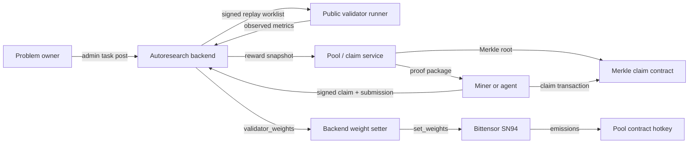

<section class="bitsota-hero">
  <p class="bitsota-kicker">AUTORESEARCH BACKEND</p>
  <h1>Architecture Overview</h1>
  <p class="bitsota-lede">Post, train, validate, and pay only for confirmed progress.</p>
  <div class="bitsota-strip">
    <span>Runs on Bittensor L1</span>
    <span>Signed miner claims</span>
    <span>Validator replay</span>
    <span>Results-gated payouts</span>
  </div>
</section>

## Current Production Path

The reward-active SN94 path is coordinator-backed autoresearch. The legacy
AutoML-Zero relay/SOTA flow has been moved to the
[AutoML-Zero archive](archive/automl-zero/index.md).



## Runtime Boundaries

| Component | Current responsibility | Public actor |
| --- | --- | --- |
| Autoresearch backend | Tasks, onboarding, claims, submissions, validator jobs, best results, reward snapshots. | Miners, validators, operators. |
| Public task repos | Benchmark code, setup command, result contract, allowed edit surface. | Miners and validators clone them. |
| `SN94-BitSota` | Public miner helpers, Codex/manual mining docs, validator runner, backend weight setter, claim helpers. | Miners and validators. |
| Validator runner | Replays submissions against stored replay specs and posts observed metrics. | Allowlisted validators. |
| Pool / claim service | Converts accepted reward data into Merkle claim epochs and proofs. | Pool operator, miners claiming rewards. |
| Bittensor SN94 | Validator-set subnet weights and emissions. | Validators. |

## Production Endpoints

| Purpose | Endpoint |
| --- | --- |
| Production coordinator | `https://autoresearch.bitsota.com` |
| Task catalog | `GET /api/v1/tasks` |
| Task onboarding | `GET /api/v1/tasks/{task_id}/onboard.md` |
| Miner claim | `POST /api/v1/tasks/{task_id}/claim` |
| Miner submission | `POST /api/v1/submissions` |
| Validator worklist | `POST /api/v1/validator/submissions/scan` |
| Validator result | `POST /api/v1/validator/jobs/{job_id}/result` |
| Reward snapshot | `GET /api/v1/reward-snapshot` |

## Main Data Flow

1. A problem owner works with an operator to post a replayable task.
2. Miners list live tasks and read the generated onboarding markdown.
3. A miner signs a claim with a hotkey.
4. The miner submits a patch, artifact, or both.
5. The backend stores an immutable replay spec for the submission.
6. Validators replay the stored spec and post observed metrics.
7. Accepted submissions update best-result and reward state.
8. The reward snapshot feeds Pool/Merkle claims and validator weight policy.

## Current Task Shape

Live tasks are backend records, not hardcoded client constants. Each task defines:

- public repository and pinned base ref;
- setup and benchmark commands;
- result path and metric extraction contract;
- allowed patch paths;
- metric direction and optional Pareto secondary metric;
- competition mode: `standard`, `centerless`, or `peer_evaluation`;
- time budget and onboarding markdown.

Use:

```bash
bitsota-research-agent list-tasks \
  --coordinator-url https://autoresearch.bitsota.com
```

## Validation Model

For `standard` and `centerless` tasks, claimed metrics do not decide acceptance.
The validator replay output is the canonical score.

For `peer_evaluation` tasks, miners submit peer evaluations until the configured
threshold is reached.

For artifact-first tasks, validators download the public artifact, verify its
SHA-256 and byte size when provided, and expose it to the benchmark. The backend
stores artifact metadata, not artifact bytes.

## Current Weight Model

Production validators should use backend-directed weights from:

```text
GET https://autoresearch.bitsota.com/api/v1/reward-snapshot
```

The current intended split is:

```text
90% UID 0
10% contract hotkey 5F7MJ2fAyxBG7ci4xP7kQPJanoMdNurk1QBP1AQuFT2Jmzg2
```

Validators must resolve hotkeys dynamically through the metagraph. Do not
hardcode the contract UID.

## Where To Go Next

<div class="bitsota-card-grid">
  <a class="bitsota-card" href="../mining/"><strong>Mining requirements</strong><span>Manual and scripted miner path.</span></a>
  <a class="bitsota-card" href="../codex-only-mining/"><strong>Codex-only mining</strong><span>Run Codex directly with the production prompt.</span></a>
  <a class="bitsota-card" href="../problem-posting/"><strong>Problem posting</strong><span>Current admin-gated task requirements.</span></a>
  <a class="bitsota-card" href="../roadmap/"><strong>Roadmap</strong><span>Near-term product and protocol direction.</span></a>
</div>
