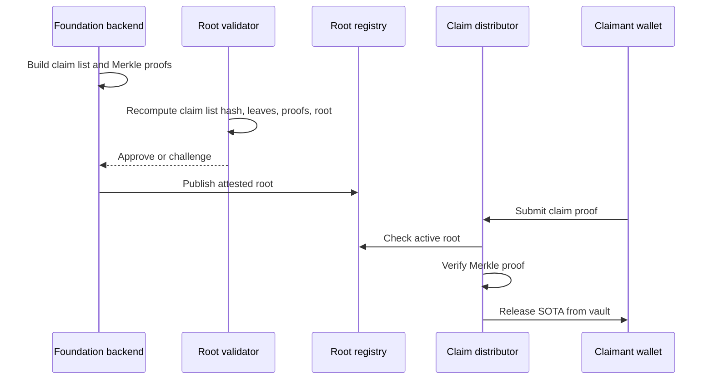

# How Base SOTA Works

Base SOTA has two jobs:

1. Give eligible legacy holders a one-time genesis claim.
2. Pay ongoing SOTA emissions to miners whose work passes self-validation.

Both jobs end the same way: a claim root is published, the indexer serves a
proof, and the user claims SOTA with their own Base wallet.

## Component Map

| Component | Plain-English role |
| --- | --- |
| SOTA token | The ERC-20 token users receive when they claim. |
| Vault | Holds SOTA until an approved claim distributor releases it. |
| Root registry | Stores the active genesis and emission claim roots. |
| Lane registry | Tracks SOTA-native competition categories and budgets. |
| Genesis distributor | Verifies one-time snapshot claims. |
| Emission distributor | Verifies miner reward claims from self-validated competitions. |
| Indexer/API | Serves eligibility, proofs, claim state, and unsigned claim calldata. |
| Website | Gives users a wallet-facing claim and demo experience. |

`SOTALaneRegistry` and `offchainLaneId` are Base SOTA terms. They identify
SOTA-native competition lanes. They do not mean Bittensor netuids, metagraph
UIDs, Yuma weights, or Substrate emissions.

## Claim Root Lifecycle

## Two Claim Types

| Claim type | Who receives it | Proof contains |
| --- | --- | --- |
| Genesis | A legacy holder who binds a Bittensor coldkey to a Base wallet. | Amount, Base account, allocation hash, and Merkle proof. |
| Emission | A miner or reward wallet from a validated competition result. | Epoch, lane ID, amount, reward hash, and Merkle proof. |

## Design Choices

- Base is the settlement layer. Users claim with EVM wallets.
- Ongoing rewards are paid in SOTA, not in TAO or protocol alpha.
- Competitions are grouped by SOTA-native lanes, not Bittensor netuids.
- The first local demo is centralized enough to be understandable: one launcher
  starts the stack and seeds demo users.
- Claim roots must still be reproducible. A validator can recompute leaves,
  proofs, and roots before a root becomes claimable.

## Current Testnet State

- Local demo evidence covers the full local loop: contracts, indexer/API,
  autoresearch backend, UI, genesis claim, mined emission claim, and
  self-validation.
- Base Sepolia has a deployment manifest, deployed test contracts, public
  claims UI/API services, finalized test-only claim artifacts, and green
  browser smoke for the current seeded wallet/root cycle.
- The Base Sepolia dry run is still not a mainnet launch. Full testnet evidence
  turns green only after the current seeded MetaMask wallet submits both the
  genesis and emission claim transactions and those hashes verify.
- No final multisig/timelock ownership transfer, external audit signoff, or
  Base mainnet release evidence is claimed by these testnet artifacts.
