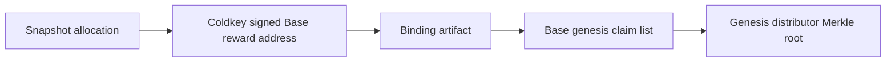

# Claims And Allocation

Base SOTA has two claim paths:

1. Genesis claims from the legacy TAO/alpha snapshot.
2. Ongoing SOTA emission claims from self-validated competitions.

The local demo shows both paths with seeded users:

```bash
cd /home/mekaneeky/repos/SN94-BitSota-live-docs
./scripts/sota_local_demo.py launch
```

## Genesis Allocation Rule

Genesis SOTA credit is:

```text
direct TAO credit 1:1
+ synthetic alpha credit from the approved pro-rata pool formula
```

The synthetic alpha side follows the deregistration-style pro-rata formula:

```text
alpha held percent * TAO in pool
```

Dust remains unallocated and must be reported in the manifest.

## Coldkey Binding

Genesis is non-custodial. The user signs a binding with the legacy Bittensor
coldkey and chooses a Base wallet. The coldkey proves snapshot ownership. The
Base wallet receives SOTA.

The legacy coldkey does not custody Base SOTA. If a user cannot prove ownership
of the snapshot coldkey, the system cannot create a genesis claim for that user.

The local demo does not prove live Bittensor coldkey ownership. It uses a
seeded old coldkey plus a local EVM reward address so a tester can exercise the
MetaMask claim path without touching production Bittensor.

The final Base genesis claim root is built after binding:



The on-chain claim uses:

```solidity
GenesisClaimDistributor.claim(rootId, amount, allocationHash, proof)
```

where `allocationHash` is the binding artifact hash.

## Ongoing Emissions

Ongoing emissions are paid in SOTA only. A miner submission carries:

- EVM miner address;
- optional reward address;
- nonce;
- competition ID;
- SOTA-native lane/category ID, encoded as `offchainLaneId`;
- artifact hash;
- miner signature;
- optional reward-address delegation signature.

The reward address is the claim account. After self-validation accepts the
submission, the backend can include it in an emission claim root.

The emission claim uses:

```solidity
EmissionClaimDistributor.claim(
    rootId,
    epoch,
    offchainLaneId,
    amount,
    rewardHash,
    proof
)
```

## What The Website Gets From The Indexer

The indexer prepares the data the website needs for a wallet claim:

- `root_id`
- `amount`
- `leaf`
- `proof`
- `claim_args`

For genesis, `claim_args` includes:

```json
{
  "kind": "genesis",
  "allocation_hash": "0x..."
}
```

For emissions, `claim_args` includes:

```json
{
  "kind": "emission",
  "epoch": 7,
  "offchain_lane_id": "0x...",
  "reward_hash": "0x..."
}
```

The transaction-builder endpoint returns unsigned calldata. Claimants still
sign and submit with their own wallet.

## What Users Should Check

Before claiming, a user should be able to see:

1. The claim type: genesis or emission.
2. The receiving Base wallet.
3. The amount of SOTA.
4. The proof and root used by the distributor.
5. The local or deployed network where the transaction will be submitted.
