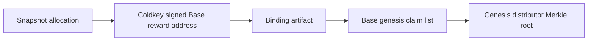

# Claims And Allocation

Base SOTA has two claim paths:

1. Genesis claims from the legacy TAO/alpha snapshot.
2. Ongoing SOTA emission claims from self-validated competitions.

The local demo shows both paths with seeded users:

```bash
cd /home/mekaneeky/repos/SN94-BitSota-live-docs
./scripts/sota_local_demo.py launch
```

## Genesis Allocation Rule

Genesis SOTA credit is:

```text
direct TAO credit 1:1
+ synthetic alpha credit from the approved pro-rata pool formula
```

The synthetic alpha side follows the deregistration-style pro-rata formula:

```text
alpha held percent * TAO in pool
```

The implementation computes this per subnet as:

```text
floor(user_total_alpha_units * tao_in_pool_rao / total_eligible_alpha_units)
```

The final genesis amount is `direct_tao_rao + alpha_credit_rao`, converted to
18-decimal SOTA units at `1 rao = 1e9 SOTA units`. This does not bridge alpha
tokens; it gives a one-time synthetic SOTA credit for eligible alpha exposure.

Dust remains unallocated and must be reported in the manifest.

## Coldkey Binding

Genesis is non-custodial. The user signs a binding with the legacy Bittensor
coldkey and chooses a Base wallet. The coldkey proves snapshot ownership. The
Base wallet receives SOTA.

The legacy coldkey does not custody Base SOTA. If a user cannot prove ownership
of the snapshot coldkey, the system cannot create a genesis claim for that user.

The claims API can generate the exact message a user must sign without seeing
the user's private key:

```bash
curl -fsS -X POST "$SOTA_CLAIMS_API_URL/api/v1/base/genesis/binding-message" \
  -H 'content-type: application/json' \
  --data '{"coldkey":"5...","reward_address":"0x..."}'
```

The response includes the direct TAO credit, alpha-derived credit, total SOTA
amount, signing payload, payload hash, and a binding JSON template. The user
signs the payload with the snapshot coldkey and submits the signed binding:

```bash
curl -fsS -X POST "$SOTA_CLAIMS_API_URL/api/v1/base/genesis/bindings" \
  -H 'content-type: application/json' \
  --data '{"message":{...},"signature":"0x..."}'
```

The claims API verifies the SR25519 coldkey signature against the frozen
snapshot, Base chain ID, genesis distributor, reward wallet, direct TAO credit,
and alpha-derived credit before storing the accepted binding for the next
genesis root. The website exposes the same flow from the Genesis tab with the
`Binding payload` and `Submit binding` buttons.

In the browser, a claimant can use the `Sign with extension` button after
creating the binding payload. The page asks an injected Polkadot-compatible
extension to sign the exact payload with the entered snapshot coldkey. It never
asks for a seed phrase or private key. If the extension does not expose the
coldkey, the claimant can still copy the payload and paste a signature manually.

For a claimant with a local Bittensor wallet, the helper command signs and
submits the binding without exposing the coldkey seed phrase:

```bash
cd /home/mekaneeky/repos/SN94-BitSota-live-docs
python3 scripts/sota_sign_snapshot_binding.py \
  --claims-api-url "$SOTA_CLAIMS_API_URL" \
  --reward-address 0xYourBaseWallet \
  --wallet-name default \
  --submit
```

If the wallet coldkey file is encrypted, the helper prompts for the local
wallet password. It refuses to sign if the local coldkey does not match the
snapshot binding message.

The local demo does not prove live Bittensor coldkey ownership. It uses a
seeded old coldkey plus a local EVM reward address so a tester can exercise the
MetaMask claim path without touching production Bittensor.

The final Base genesis claim root is built after binding:



The on-chain claim uses:

```solidity
GenesisClaimDistributor.claim(rootId, amount, allocationHash, proof)
```

where `allocationHash` is the binding artifact hash.

For Base Sepolia operator runs, signed snapshot bindings must be passed
explicitly so genesis uses the real TAO plus alpha snapshot bridge:

```bash
python3 scripts/sota_base_testnet_operator.py \
  --deployment /home/mekaneeky/repos/.sota-base-testnet/base-sepolia-compact-deployment.json \
  --emission-evidence /path/to/accepted-emission-evidence.json \
  --snapshot-dir /mnt/4tb/tao_fork_snapshot \
  --snapshot-claim-binding /path/to/signed-coldkey-binding.json \
  --broadcast-roots \
  --import-artifacts
```

If claimants submitted signed bindings through the claims API, the operator can
export the accepted bindings instead of passing local files. Load the claims
API admin token into `SOTA_BASE_INDEXER_ADMIN_TOKEN`; the operator also accepts
the older `SOTA_INDEXER_ADMIN_TOKEN` name for local scripts.

```bash
python3 scripts/sota_base_testnet_operator.py \
  --deployment /home/mekaneeky/repos/.sota-base-testnet/base-sepolia-compact-deployment.json \
  --emission-evidence /path/to/accepted-emission-evidence.json \
  --snapshot-dir /mnt/4tb/tao_fork_snapshot \
  --snapshot-claim-bindings-url "$SOTA_CLAIMS_API_URL/api/v1/base/genesis/bindings" \
  --broadcast-roots \
  --import-artifacts
```

If a snapshot binding is supplied and the snapshot bridge fails, the operator
removes the seed genesis artifact before publish so it cannot publish a
genesis root that omits alpha.

## Ongoing Emissions

Ongoing emissions are paid in SOTA only. A miner submission carries:

- EVM miner address;
- optional reward address;
- nonce;
- competition ID;
- SOTA-native lane/category ID, encoded as `offchainLaneId`;
- artifact hash;
- miner signature;
- optional reward-address delegation signature.

The reward address is the claim account. After self-validation accepts the
submission, the backend can include it in an emission claim root.

The emission claim uses:

```solidity
EmissionClaimDistributor.claim(
    rootId,
    epoch,
    offchainLaneId,
    amount,
    rewardHash,
    proof
)
```

## What The Website Gets From The Indexer

The indexer prepares the data the website needs for a wallet claim:

- `root_id`
- `amount`
- `leaf`
- `proof`
- `claim_args`

For genesis, `claim_args` includes:

```json
{
  "kind": "genesis",
  "allocation_hash": "0x..."
}
```

For emissions, `claim_args` includes:

```json
{
  "kind": "emission",
  "epoch": 7,
  "offchain_lane_id": "0x...",
  "reward_hash": "0x..."
}
```

The transaction-builder endpoint returns unsigned calldata. Claimants still
sign and submit with their own wallet.

## What Users Should Check

Before claiming, a user should be able to see:

1. The claim type: genesis or emission.
2. The receiving Base wallet.
3. The amount of SOTA.
4. The proof and root used by the distributor.
5. The local or deployed network where the transaction will be submitted.
