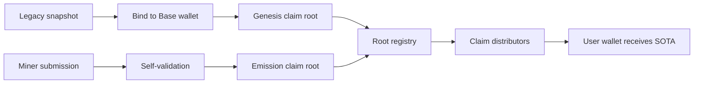

<section class="bitsota-hero">
  
Base SOTA fork

  <h1>Claim and mine SOTA on a local Base chain.</h1>
  

    Base SOTA is a Base-settled SOTA fork, not a Bittensor subnet. The local
    demo starts the EVM node, claim contracts, autoresearch backend, indexer,
    website, and docs so a tester can move through the full flow in one session.
  

  

    <a class="bitsota-button" href="local-e2e/">Run the local demo</a>
    <a class="bitsota-button secondary" href="new-users/">New user guide</a>
    <a class="bitsota-button secondary" href="bittensor-migrants/">Migrating from Bittensor</a>
  

</section>

  <section class="bitsota-panel">
    

      <h2>For A Tester</h2>
    

    

      <ol class="bitsota-step-list">
        <li><b>1</b>Start the local stack and open the printed Tester handoff URL.</li>
        <li><b>2</b>Add the local Base network in MetaMask and import the printed local-only key.</li>
        <li><b>3</b>Claim genesis SOTA, load the mined emission, inspect the 3/3 self-validation evidence, and claim again.</li>
      </ol>
    

  </section>
  <section class="bitsota-panel">
    

      <h2>What Runs Locally</h2>
    

    

      

        <b>Claim</b><small>seeded TAO + alpha accounting credit</small>
        <b>Mine</b><small>Alice submits a local frontier improvement</small>
        <b>Validate</b><small>Bob, Charlie, and Dave accept the work</small>
      

    

  </section>

  
Start the complete local stack

  <pre><code>cd /home/mekaneeky/repos/SN94-BitSota-live-docs
./scripts/sota_local_demo.py launch</code></pre>

  
<strong>Local-only</strong>Chain ID 31337, deterministic Anvil accounts, no production keys.

  
<strong>No mocks</strong>Contracts are deployed, roots are published, claims are real local EVM txs.

  
<strong>Fork logic</strong>Genesis SOTA = TAO 1:1 plus synthetic alpha pool credit.

  
<strong>Ongoing rewards</strong>SOTA emissions only after accepted self-validation evidence.

  

    <strong>Local EVM</strong>
    Deploys SOTA token, vault, root registry, lane registry, and claim distributors.
  

  

    <strong>Autoresearch backend</strong>
    Seeds a miner submission and records accepted self-validation evidence from three local peer validators.
  

  

    <strong>Claims UI</strong>
    Lets a tester claim genesis SOTA and mined emission SOTA with MetaMask.
  

## Pick Your Path

  <a class="bitsota-card" href="new-users/">
    <strong>New user</strong>
    Learn what SOTA, Base, claims, proofs, and self-validation mean before clicking through the demo.
  </a>
  <a class="bitsota-card" href="bittensor-migrants/">
    <strong>Migrating from Bittensor</strong>
    Map coldkeys, hotkeys, netuids, Yuma emissions, and alpha accounting to the Base SOTA model.
  </a>
  <a class="bitsota-card" href="local-e2e/">
    <strong>Local tester</strong>
    Run the complete local stack, import the printed wallet, claim SOTA, and inspect validation evidence.
  </a>
  <a class="bitsota-card" href="architecture/">
    <strong>Technical reviewer</strong>
    Review the contracts, root lifecycle, indexer, attestation checks, and launch gates.
  </a>

## What Base SOTA Does

Base SOTA turns research competition results into claimable SOTA on Base.

1. A legacy snapshot creates the one-time genesis allocation.
2. A claimant binds their legacy Bittensor coldkey to a Base wallet.
3. Miners submit work with an EVM identity.
4. Self-validation checks accepted work before emissions are published.
5. Claim roots are posted to the local or deployed Base contracts.
6. Users claim SOTA from their own wallet without giving custody to the app.

## Current Status

The local demo path is the supported way to experience the Base flow. It uses a
local dev chain and deterministic local accounts. It does not touch production
Bittensor, Base Sepolia, or Base mainnet.

  <strong>Local path:</strong> one launcher command deploys local contracts,
  seeds a snapshot claim, runs a miner/self-validation flow with three local
  peer validators, publishes a claim root, starts the UI, and prints the URLs a
  tester needs.

  <strong>Public deployment:</strong> Base Sepolia and Base mainnet deployment
  details are not public launch instructions until the testnet preflight gate
  is green against real deployed contracts and public service URLs.

## Keep Reading

- [One-Command Demo](local-e2e.md) for the run command, expected output, and
  troubleshooting.
- [Claims And Allocation](claims-and-allocation.md) for genesis claims,
  ongoing emissions, and wallet binding.
- [Self-Validation](self-validation.md) for how miner work becomes eligible for
  a SOTA emission.
- [Support FAQ](support-faq.md) for Base Sepolia support wording, intake fields,
  and escalation boundaries.
- [Operator Readiness](operations.md) for the launch checklist and escalation
  path.
