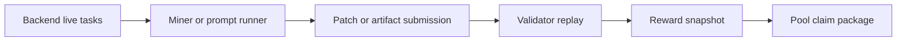

<section class="bitsota-hero">
  
BITSOTA DOCS

  <h1>BitSota Autoresearch</h1>
  
Find a live task, submit a measurable improvement, then wait for validator replay and reward publication.

  

    Live tasks
    Miner submissions
    Validator replay
    Pool claims
  

</section>

BitSota is the SN94 autoresearch subnet. The current public mining flow is
coordinator-backed: miners discover live tasks from the backend, work inside the
task's allowed surface, and submit a patch or artifact for validator replay.

## Miners Start Here

| Need | Page |
| --- | --- |
| Install the client and list live tasks | [Getting Started](getting-started.md) |
| See the current task snapshot | [Live Tasks](current-competitions.md) |
| Mine with the prompt pack | [Agent Mining](agent-mining.md) |
| Mine manually | [Manual Mining](mining.md) |
| Improve compression submissions | [Improve Submissions](miner-tips.md) |
| Claim published rewards | [Claim Rewards](claim-rewards.md) |

## Current Flow

Use `https://autoresearch.bitsota.com` as the production coordinator unless an
operator tells you otherwise.

The old AutoML-Zero relay/SOTA docs are preserved in
[AutoML-Zero Archive](archive/automl-zero/index.md). Do not use those archived
guides for current production mining.
