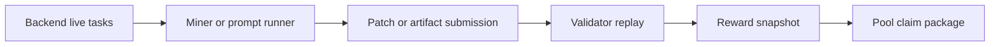

<section class="bitsota-hero">
  
BITSOTA DOCS

  <h1>BitSota research today, Base SOTA fork next.</h1>
  

    Use this site for the current autoresearch mining flow and for the Base
    SOTA fork migration path. The Base section is no longer framed as a
    Bittensor subnet: it is a Base-settled fork with SOTA claims, local EVM
    contracts, miner emissions, and self-validation evidence.
  

  

    Research tasks
    Base SOTA claims
    Self-validation
    Local fork demo
  

</section>

The current public mining flow is coordinator-backed autoresearch: miners
discover live tasks from the backend, work inside the task's allowed surface,
and submit a patch or artifact for validation. The Base SOTA work is the fork
path: local SOTA claims, EVM settlement, and ongoing emissions from accepted
work.

## Start Here

| Need | Page |
| --- | --- |
| Try the complete local Base SOTA flow | [Base SOTA](base/index.md) |
| New user with no Bittensor context | [New Users](base/new-users.md) |
| Migrating from Bittensor terms | [Bittensor Migrants](base/bittensor-migrants.md) |
| Install the client and list live tasks | [Getting Started](getting-started.md) |
| See the current task snapshot | [Live Tasks](current-competitions.md) |
| Mine with the prompt pack | [Agent Mining](agent-mining.md) |
| Mine manually | [Manual Mining](mining.md) |
| Improve compression submissions | [Improve Submissions](miner-tips.md) |
| Claim published rewards | [Claim Rewards](claim-rewards.md) |

## Current Flow

Use `https://autoresearch.bitsota.com` as the production coordinator unless an
operator tells you otherwise.

The old AutoML-Zero relay/SOTA docs are preserved in
[AutoML-Zero Archive](archive/automl-zero/index.md). Do not use those archived
guides for current production mining.

The Base SOTA fork work is tracked in the [Base SOTA](base/index.md) section.
That area has a complete local demo now and remains local/project-facing until
Base Sepolia gates are green against real deployed contracts and public service
URLs.
