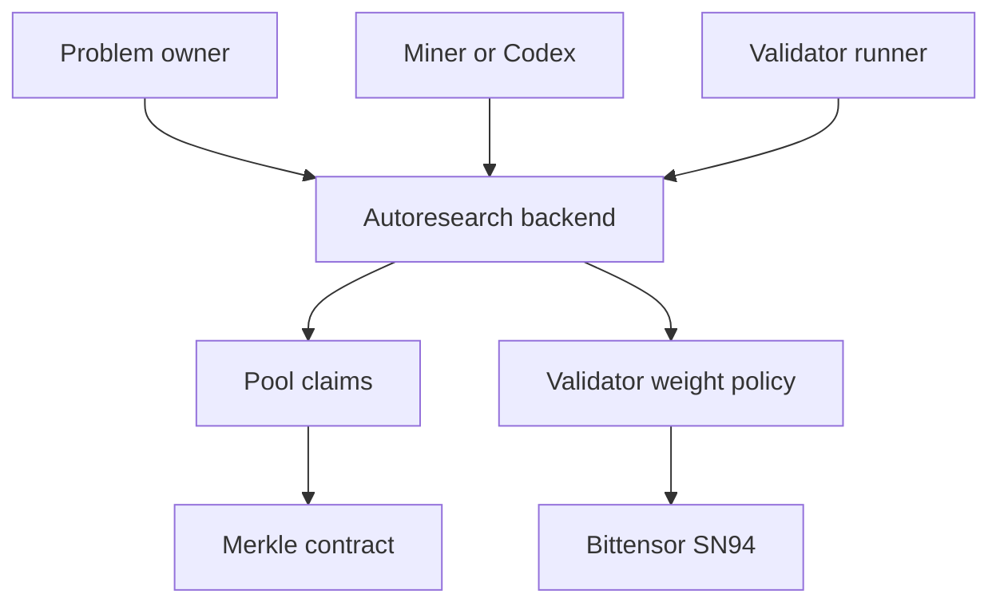

<section class="bitsota-hero">
  
BITSOTA DOCS

  <h1>Autoresearch on SN94</h1>
  
Post, train, validate, and pay only for confirmed progress.

  

    Problem owners define tasks
    Miners submit improvements
    Validators replay results
    Pool publishes claims
  

</section>

BitSota is a decentralized research subnet on Bittensor. This documentation now
focuses on the current autoresearch backend path.

The old AutoML-Zero relay/SOTA docs are preserved in
[AutoML-Zero Archive](archive/automl-zero/index.md).

## Start here

- [Getting Started](getting-started.md)
- [Architecture Overview](architecture.md)
- [Current Competitions](current-competitions.md)
- [Mining Without an Agent](mining.md)
- [Codex-Only Mining](codex-only-mining.md)
- [Problem Posting Requirements](problem-posting.md)
- [Future Roadmap](roadmap.md)

## System overview

