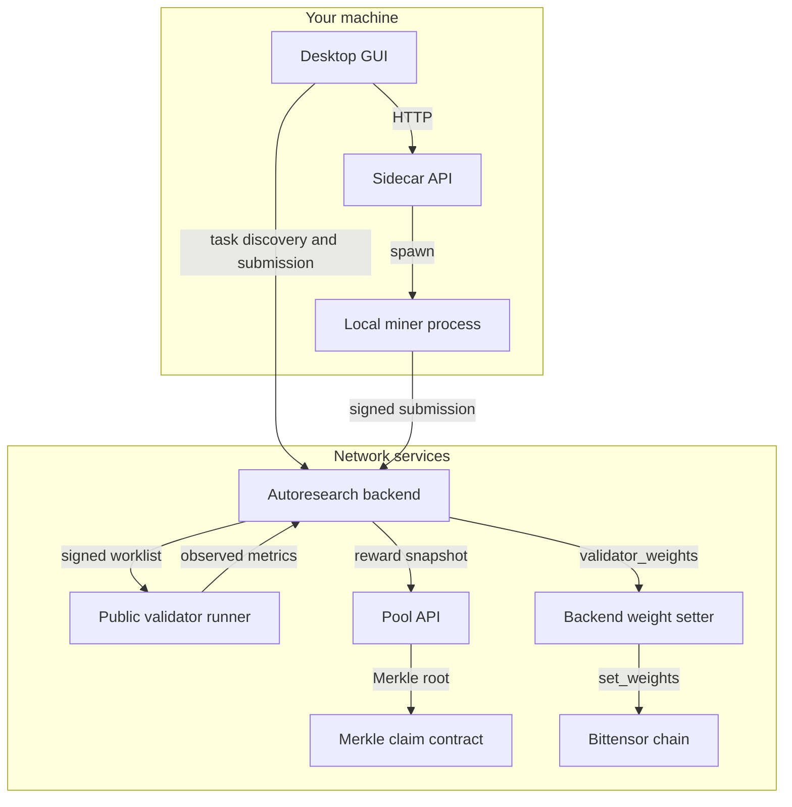

# BitSota documentation

BitSota is a decentralized research subnet on Bittensor. This documentation is organized around:

- Roles: miner, validator, pool operator
- Components: GUI, sidecar, autoresearch backend, public validator runner, pool, Merkle claim contract
- Workflows: research-agent mining, backend validation, backend-directed weights, Pool/Merkle claims, local end-to-end testing

## Start here

- [Getting Started](getting-started.md)
- [SN94 System Structure](sn94-system-structure.md)
- [Local Testing](local-testing.md)
- [Configuration Reference](configuration.md)
- [Research-Agent Mining](research-agent-mining.md)

## System overview

Default local ports used by the docs and scripts:
- Sidecar: `8123`
- Pool API: `8434`
- Pool monitor: `9000`
