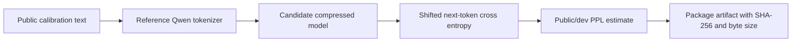

<section class="bitsota-hero compact">
  <p class="bitsota-kicker">BINARY AND TERNARY COMPETITIONS</p>
  <h1>Miner Tips</h1>
  <p class="bitsota-lede">Plain-English notebooks for building better Qwen binary and ternary compression submissions.</p>
</section>

These notebooks are public educational examples for the live Qwen binary and
ternary compression competitions. They are meant to help miners and coding
agents build stronger artifacts without guessing at validator internals.

They use toy examples, public/dev scoring patterns, and placeholders only. They
do not contain private validator data, local operator paths, auth secrets, or
leaderboard-specific hints.

## Start Here



Run these in order if you are starting from scratch:

| Notebook | Use it for | GitHub |
| --- | --- | --- |
| `00_start_here_agent_brief.ipynb` | Paste-ready agent brief and basic mental model. | [Open on GitHub](https://github.com/AlveusLabs/SN94-BitSota/blob/codex/public-docs-hosting-20260604/docs/notebooks/miner-tips/00_start_here_agent_brief.ipynb) |
| `01_public_ppl_and_packaging.ipynb` | Qwen-token PPL shape, artifact zip, SHA-256, byte-size checks. | [Open on GitHub](https://github.com/AlveusLabs/SN94-BitSota/blob/codex/public-docs-hosting-20260604/docs/notebooks/miner-tips/01_public_ppl_and_packaging.ipynb) |
| `02_rowmix_q4_rescue_baseline.ipynb` | Row sensitivity, binary/ternary rows, and small q4 rescue rows. | [Open on GitHub](https://github.com/AlveusLabs/SN94-BitSota/blob/codex/public-docs-hosting-20260604/docs/notebooks/miner-tips/02_rowmix_q4_rescue_baseline.ipynb) |
| `03_layerwise_distillation.ipynb` | Distill one compressed layer at a time instead of training everything at once. | [Open on GitHub](https://github.com/AlveusLabs/SN94-BitSota/blob/codex/public-docs-hosting-20260604/docs/notebooks/miner-tips/03_layerwise_distillation.ipynb) |
| `04_net2net_widen_then_quantize.ipynb` | Function-preserving widening before binary/ternary quantization. | [Open on GitHub](https://github.com/AlveusLabs/SN94-BitSota/blob/codex/public-docs-hosting-20260604/docs/notebooks/miner-tips/04_net2net_widen_then_quantize.ipynb) |
| `05_diagnostics_and_traps.ipynb` | Compare recipes and avoid proxy-only wins that hurt text PPL. | [Open on GitHub](https://github.com/AlveusLabs/SN94-BitSota/blob/codex/public-docs-hosting-20260604/docs/notebooks/miner-tips/05_diagnostics_and_traps.ipynb) |

The same files are also served by the docs site, starting with
[`00_start_here_agent_brief.ipynb`](notebooks/miner-tips/00_start_here_agent_brief.ipynb).

## Practical Recipe

For a first serious submission, do not start every idea directly on the full
27B model. First test the idea on a small public model, a few layers, or a toy
CPU run so you can see whether the method is sane. This makes research faster
even if you have plenty of GPUs, because bad ideas fail quickly and promising
recipes get more iteration time. Once the public/dev signal improves, scale the
same recipe to larger Qwen checkpoints and finally to the competition artifact.

1. Prototype the method on a small public model or a small slice of layers.
2. Measure public/dev Qwen-token PPL before optimizing anything else.
3. Build a simple binary or ternary artifact that loads cleanly.
4. Add row sensitivity scoring and q4 rescue for the most fragile rows.
5. Add layerwise distillation when direct quantization is too lossy.
6. Try Net2Net-style widening when you need more low-bit capacity.
7. Scale only the promising recipe to the target-size artifact.
8. Package deterministically and verify artifact URL, SHA-256, and byte size.

## What To Avoid

- Do not optimize only reconstruction error or row MSE.
- Do not assume pure binary or pure ternary everywhere is best.
- Do not include notebook outputs, caches, local absolute paths, or private files.
- Do not depend on auth secrets or machine-local model paths.
- Do not present public/dev PPL as a guaranteed leaderboard score.

## Agent Prompt

```text
Build a public/dev-only Qwen compression experiment for the BitSota binary or
ternary competition.

Use the task repository and public onboarding instructions. Score with the
reference Qwen tokenizer and shifted next-token cross entropy. First test ideas
on small public models, a few layers, or CPU toy runs so research iterations are
fast; then scale only recipes that improve public/dev PPL. Start with rowmix
plus q4 rescue, then try layerwise distillation, then try Net2Net-style widening
before quantization. Package the model artifact with a stable URL, SHA-256, and
exact byte size. Do not include private validator data, auth secrets, local
operator paths, caches, or notebook outputs.
```

## Competition Fit

These tips apply to both current Qwen compression tracks:

- **Binary frontier**: mostly binary weights, with targeted rescue/fallback when
  needed for quality.
- **Ternary frontier**: mostly ternary weights, with the same discipline around
  fragile modules and public/dev PPL checks.

The artifact is what validators score. A recipe patch can explain how the model
was made, but it is not a substitute for a loadable compressed model artifact.
