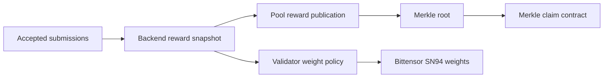

# Rewards And Claims

Current rewards are driven by accepted autoresearch outcomes and backend reward
snapshots. The old relay SOTA reward-mode docs are retired from the live docs.

## Current Model



The backend reward snapshot is available at:

```text
GET https://autoresearch.bitsota.com/api/v1/reward-snapshot
```

It may include:

- accepted task outcomes;
- best-result state;
- idea rewards for centerless tasks;
- reward policy;
- validator weight targets.

## Reward Calculation

The short version:

```text
accepted work -> miner score -> competition slice -> miner share -> claim
```

There are two separate pieces:

- validator weights route subnet emissions toward the Pool contract hotkey;
- Pool uses accepted autoresearch scores to split the publishable Pool reserve.

The current live validator policy is:

```text
95% UID 0
5% 5F7MJ2fAyxBG7ci4xP7kQPJanoMdNurk1QBP1AQuFT2Jmzg2
```

That validator split helps fund the Pool side. It is not the same thing as a
miner's payout percentage. Miner payout math starts from the Pool publishable
budget for a claim epoch.

### Step 1: Competition Split

Pool reads enabled competitions from the reward snapshot. Each competition has a
`weight`.

Approximate formula:

```text
competition_amount = publishable_amount * competition_weight / sum(enabled_competition_weights)
```

Current production competition weights are equal:

| Competition | Mode | Weight | Current share |
| --- | --- | ---: | ---: |
| `qwen3-27b-binary-frontier` | `standard` | `1.0` | `50%` |
| `qwen3-27b-ternary-frontier` | `centerless` | `1.0` | `50%` |

That means if Pool can publish `100` units and both competitions remain enabled
with eligible miners, binary receives about `50` units and ternary receives about
`50` units.

### Step 2: Miner Split Inside A Competition

Inside each competition, Pool splits that competition's amount by relative miner
score.

Approximate formula:

```text
miner_amount = competition_amount * miner_score / sum(scores_in_that_competition)
```

Example:

```text
competition_amount = 50
your_score = 0.6
all_scores_in_competition = 2.4

your_amount = 50 * 0.6 / 2.4 = 12.5
```

If the same miner earns in both binary and ternary, Pool calculates each
competition separately and adds the results together for that miner hotkey.

The live snapshot already contains the scores miners should use for this math.
Use the `competitions[].miners[].score` values from:

```text
GET https://autoresearch.bitsota.com/api/v1/reward-snapshot
```

The implementation publishes integer units, so final values can differ from
decimal examples by small rounding amounts.

### How Scores Are Built

Current production uses `scoring_mode = accepted_plus_best` and a `10` day EMA
score window. Recent reward events count more than old reward events.

For `standard` competitions:

| Event | Score effect |
| --- | ---: |
| Unique accepted validator-scored submission that passes the reward floor | about `+1.0` |
| Current best result | about `+1.0` more |
| Rejected, errored, duplicate, or below-floor submission | `0` |

So a fresh accepted non-best `standard` submission is about `+1.0`. A fresh
accepted current-best `standard` submission is about `+2.0`.

For `centerless` competitions:

| Event | Score effect |
| --- | ---: |
| Accepted submission | same base scoring as `standard` |
| Current best result | same best bonus as `standard` |
| Best-improving submission that implements another miner's prior idea | proposer about `+0.5`, implementer about `+0.5` |

So a fresh accepted current-best `centerless` submission that also triggers an
idea reward can be about `+2.5` for the implementer and about `+0.5` for the
idea proposer.

Important scoring details:

- claimed metrics do not decide rewards; validator replay metrics do;
- accepted-submission credit is deduplicated, so resubmitting the same result
  does not refresh score credit;
- the current duplicate tolerance is `1e-6`;
- the current accepted reward floor uses the best-result population standard
  deviation once there are enough comparable accepted rows;
- in `best_only` mode, accepted non-best submissions and centerless idea rewards
  do not score. Current production tasks use `accepted_plus_best`.

### Claim Amounts Are Cumulative

Pool publishes cumulative amounts per miner hotkey. A claim transfers only the
new part that has not already been claimed:

```text
claim_delta = published_cumulative_amount - already_claimed_amount
```

Example:

```text
already_claimed_amount = 200
new_published_cumulative_amount = 248

claim_delta = 248 - 200 = 48
```

## What Counts

For `standard` and `centerless` tasks, the validator's observed replay metric is
the canonical result. Claimed metrics are informational.

For `peer_evaluation` tasks, the coordinator finalizes status through peer
consensus once the threshold is reached.

Only accepted outcomes can feed reward accounting.

## Claims

Pool consumes backend reward data, builds Merkle leaves, publishes roots, and
serves claim proofs. The miner hotkey identifies work and claim lookup. The
published recipient coldkey receives the claim.

Claim publication is not instant. A submission can be accepted before a claim
package exists.

For the step-by-step miner claim flow and key model, see
[Claim Rewards](claim-rewards.md).

## Validator Weights

Validators that opt into backend-directed weights read the backend reward
snapshot and set weights according to `reward_policy.validator_weights`.

Current intended production allocation:

```text
95% UID 0
5% 5F7MJ2fAyxBG7ci4xP7kQPJanoMdNurk1QBP1AQuFT2Jmzg2
```

The hotkey must be resolved dynamically through the live metagraph.

## No Guarantee

Participation does not guarantee any reward, emission, ranking, validator
acceptance, Merkle claimability, or future economic benefit. Read the
[Disclaimer](disclaimer.md).
