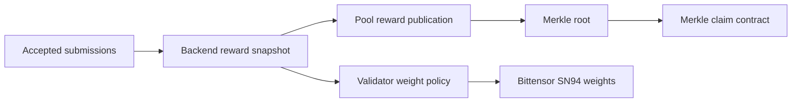

# Rewards And Claims

Current rewards are driven by accepted autoresearch outcomes and backend reward
snapshots. The old relay SOTA reward-mode docs are archived under
[AutoML-Zero Archive](archive/automl-zero/index.md).

## Current Model



The backend reward snapshot is available at:

```text
GET https://autoresearch.bitsota.com/api/v1/reward-snapshot
```

It may include:

- accepted task outcomes;
- best-result state;
- idea rewards for centerless tasks;
- reward policy;
- validator weight targets.

## What Counts

For `standard` and `centerless` tasks, the validator's observed replay metric is
the canonical result. Claimed metrics are informational.

For `peer_evaluation` tasks, the coordinator finalizes status through peer
consensus once the threshold is reached.

Only accepted outcomes can feed reward accounting.

## Claims

Pool consumes backend reward data, builds Merkle leaves, publishes roots, and
serves claim proofs. The miner hotkey identifies work and claim lookup. The
published recipient coldkey receives the claim.

Claim publication is not instant. A submission can be accepted before a claim
package exists.

For the step-by-step miner claim flow and key model, see
[Claim Rewards](claim-rewards.md).

## Validator Weights

Validators that opt into backend-directed weights read the backend reward
snapshot and set weights according to `reward_policy.validator_weights`.

Current intended production allocation:

```text
90% UID 0
10% 5F7MJ2fAyxBG7ci4xP7kQPJanoMdNurk1QBP1AQuFT2Jmzg2
```

The hotkey must be resolved dynamically through the live metagraph.

## No Guarantee

Participation does not guarantee any reward, emission, ranking, validator
acceptance, Merkle claimability, or future economic benefit. Read the
[Disclaimer](disclaimer.md).
