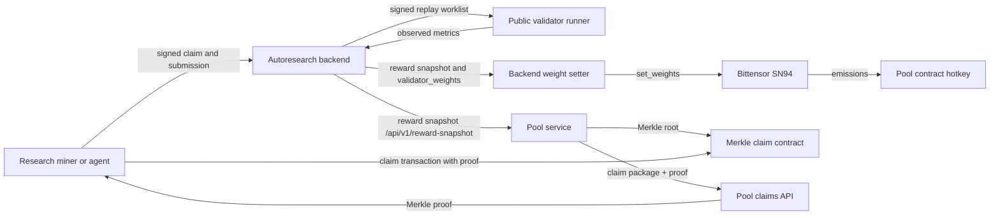

# SN94 System Structure

This page explains how the current SN94/BitSota/autoresearch stack is split
across services. Read this before running a validator so the backend,
validator runner, weight setter, Pool service, and claim contract boundaries
are clear.

## Current Production Path

The reward-active production path is coordinator-backed autoresearch:



## Repositories

| Repo | Responsibility | Who normally runs it |
| --- | --- | --- |
| `autoresearch-bittensor` | Coordinator API, task catalog, submissions, validator job worklists, validator result consensus, reward snapshots, private heldout delivery. | Backend operator / App Runner. |
| `SN94-BitSota` | Public miner and validator client code: GUI, agent/manual mining docs, signed request helpers, Docker replay runner, backend weight setter. | Miners and validators. |
| Public task repos | Public replay specification per competition: benchmark scripts, allowed patch surface, result JSON contract, public smoke harness. | Cloned by public validator runner. |
| `Pool` | Pool accounting, reward publication, Merkle proof API, Merkle contract package and deployment metadata. | Pool operator / App Runner. |
| `94-agent-community` | Local operator memory, SOPs, endpoints, role prompts, and secrets notes for this machine. | Local agents/operators only. |

Validators normally need `SN94-BitSota` only. They do not need the private
coordinator database, AWS App Runner access, or Pool publisher secrets.

## Main Runtime Components

### Autoresearch Backend

The backend is the source of truth for:

- active competitions and task metadata;
- miner claims and submissions;
- validator allowlist and signed validator worklists;
- private heldout selectors and Hugging Face row-source specs;
- validator result collection and consensus;
- reward snapshot output for Pool and validator weight setting.

Public miner task APIs hide validator-private replay parameters. Allowlisted
validators get private replay parameters only through signed validator endpoints.

### Public Task Repos

Each competition points to a public task repo plus a pinned base ref. The task
repo owns:

- benchmark command;
- result JSON schema;
- public smoke/golden checks;
- allowed miner edit paths;
- local manifest reader used by private heldout replay.

The task repo should not fetch private heldout data during reward validation.
The validator host resolves backend-heldout inputs before Docker starts and
passes only local manifest paths into the sandbox.

### SN94 Public Validator Runner

The public validator runner lives in `SN94-BitSota` and does this loop:

1. Sign a request with the validator hotkey.
2. Call `POST /api/v1/validator/submissions/scan`.
3. Clone the task repo and checkout the pinned base ref.
4. Apply the miner patch or download the submitted artifact.
5. Prefetch backend-provided heldout rows on the host.
6. Run setup and benchmark in the Docker/CUDA sandbox.
7. Parse the result JSON.
8. Post observed metrics to `POST /api/v1/validator/jobs/{job_id}/result`.

It does not set chain weights. It does not publish Merkle roots. It does not
need Pool contract ownership.

### Backend Weight Setter

The backend weight setter is a separate process in `SN94-BitSota`. It polls:

```text
GET /api/v1/reward-snapshot
```

Then it reads `reward_policy.validator_weights` and calls Bittensor
`set_weights`. Production should point some configured percentage at the Pool
contract hotkey:

```text
5F7MJ2fAyxBG7ci4xP7kQPJanoMdNurk1QBP1AQuFT2Jmzg2
```

Only one weight-owning process should run per validator hotkey. If a validator
runs another process that also calls `set_weights`, those processes can fight
each other.

### Pool Service

Pool is a separate service and repo. In the current autoresearch payout path,
Pool consumes backend reward/accounting outputs, builds claimable Merkle leaves,
publishes roots on-chain, and serves claim proofs.

Production Pool should not include operator-launched verifier/challenge daemons.
Validators run their own validation/verifier processes with their own keys. The
challenge-capable Pool/Merkle verifier currently lives in the private `Pool`
repo, so vetoer operators need GitHub access to that repo.

### Merkle Claim Contract

The Merkle contract is the claim settlement contract.

Important concepts:

- Pool publisher posts Merkle roots.
- Users claim from leaves with Merkle proofs.
- Veto state can lock claims while an active challenge exists.
- Contract vetoers/arbiter are contract governance roles, not validator job
  runners.

Validators generally do not need Merkle contract owner or publisher keys.

## Identity And Key Roles

| Key/address | Used for | Held by |
| --- | --- | --- |
| Miner hotkey | Signs claims/submissions; identifies miner work. | Miner. |
| Recipient coldkey | Receives Pool/Merkle claim payout. | Miner/operator chosen recipient. |
| Validator hotkey | Signs validator scan/result requests and may set chain weights. | Validator. |
| Backend validator allowlist | Controls which validator hotkeys receive private replay work. | Backend operator. |
| Pool publisher key | Publishes Merkle roots. | Pool operator only. |
| Contract hotkey | Receives validator-set subnet emissions for the Pool/contract path. | Registered hotkey controlled by the contract coldkey path. |
| Vetoer/arbiter keys | Lock or clear contract claimability according to contract rules. | Governance operators. |

Do not put mnemonics or private keys in tracked docs.

## Data Flow By Phase

### 1. Task Discovery

Miners read public task metadata from the backend. Public metadata is enough to
know what to edit or what artifact to submit, but it does not reveal private
heldout data.

### 2. Submission

The miner submits a patch or artifact URI plus integrity metadata. Artifact
competitions require validators to download the exact bytes and verify SHA-256
and size.

### 3. Validation

Allowlisted validators receive replay specs through signed backend worklists.
For `standard` and `centerless` tasks, an accepted replay's observed task metric
is the canonical score; claimed metrics do not decide acceptance and the normal
path does not average validator results. For `peer_evaluation` tasks, peer
evaluations finalize consensus once accepted or rejected counts reach
`min_peer_evaluations`, and accepted peer metrics use the median task metric.

### 4. Reward Snapshot

The backend turns accepted submissions and competition policy into a reward
snapshot. The snapshot can contain both miner reward accounting and
`validator_weights` for validators to apply on-chain.

### 5. Chain Weights

Validators that opt in to backend-controlled weights run the backend weight
setter. That process reads `validator_weights` and submits Bittensor
`set_weights` from the validator hotkey.

### 6. Pool/Merkle Claim

Pool consumes the reward data, builds a claim epoch, publishes a Merkle root,
and serves proofs. Users claim against the contract when the root is published
and no veto locks claims.

## What A Public Validator Needs

Required:

- `SN94-BitSota:main` checkout unless an operator explicitly gives a staging branch;
- registered SN94 validator hotkey;
- backend allowlist entry for that hotkey;
- Docker and NVIDIA Container Toolkit on a GPU host;
- enough disk/workspace for task repos, artifacts, and temporary heldout
  manifests;
- optional Hugging Face token on the host if backend-selected datasets require
  authentication.

Not required:

- production database access;
- AWS App Runner access;
- Pool publisher key;
- Merkle contract owner key;
- private task source beyond what the backend returns in signed replay specs.

## Environment Separation

Testing and production are intentionally different:

- test backend and prod backend can point at different App Runner services;
- testing and production branches can drift for environment config;
- SN402 testnet values must not be copied into SN94 production config;
- production Pool should publish and serve claims, not run operator-owned
  verifier daemons.

Treat endpoint or branch drift as a problem only when the missing change is
required for that target environment's behavior or safety.

## Common Confusions

| Confusion | Correct model |
| --- | --- |
| "The public validator runner sets weights." | It only replays submissions and posts metrics. Run the backend weight setter separately. |
| "The task repo should fetch HF heldout rows in Docker." | The validator host fetches heldout rows before Docker and passes a local manifest into the sandbox. |
| "Validators need backend DB or AWS." | Public validators use signed HTTP APIs only. |
| "One validator process can do everything safely." | Replay, weight setting, and Pool publishing are separate responsibilities. |
| "Testing and production branches must be identical." | They can differ where environment settings differ. |

## Where To Go Next

- Public validator setup: [Public Autoresearch Validator Runner](public-validator-runner.md)
- Miner flow: [Manual Mining](mining.md) and [Agent Mining](agent-mining.md)
- Pool claims and testing: [Autoresearch Testnet E2E](guides/autoresearch-testnet-e2e.md)
